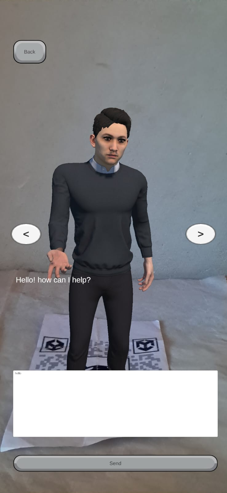
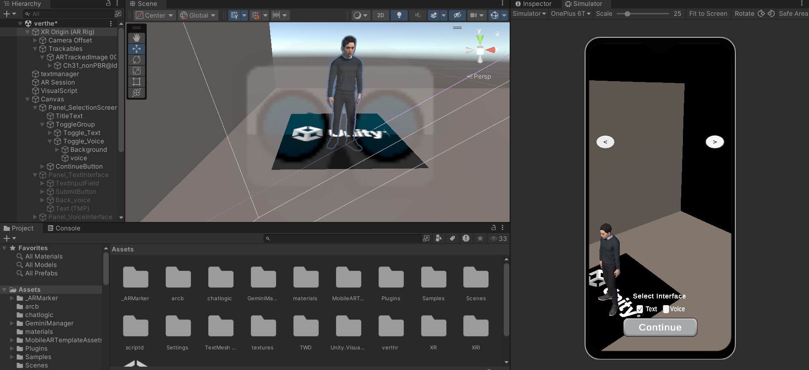
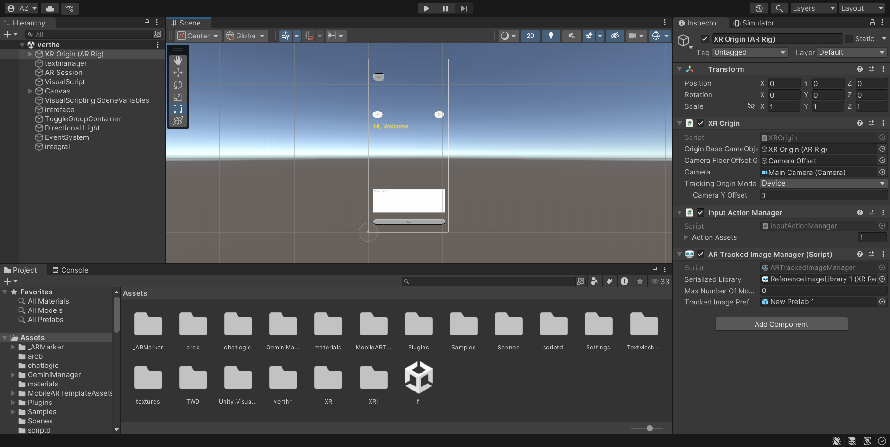

# Augmented Reality Support Assistant for College Services

## Overview

Augmented Reality Support Assistant for College Services is an Android-based application that combines Augmented Reality (AR) and Conversational AI to provide an interactive virtual assistant for students and staff. The application enables users to access college-related information through a 3D chatbot placed in the real-world environment using AR technology.

The chatbot supports both voice and text interactions and leverages Google Dialogflow for Natural Language Processing (NLP), Google Cloud Speech-to-Text for voice recognition, and Google Cloud Text-to-Speech for voice responses. Developed using Unity and ARCore, the application delivers an immersive and user-friendly experience.

---

## Features

- Android-based Augmented Reality application
- Interactive 3D virtual assistant
- Voice and text-based user interaction
- Natural Language Processing using Google Dialogflow
- Speech-to-Text and Text-to-Speech integration
- Real-time AR environment using ARCore
- REST API integration for chatbot communication
- Responsive and intuitive user interface

---

## Technology Stack

| Category | Technologies |
|----------|--------------|
| Programming Language | C# |
| AR Development | Unity, ARCore |
| Conversational AI | Google Dialogflow |
| Cloud Services | Google Cloud Platform |
| Voice Processing | Google Speech-to-Text, Google Text-to-Speech |
| Communication | REST APIs |
| Platform | Android |

---

## System Architecture

```text
                User
                  │
        Voice / Text Input
                  │
      Speech-to-Text (Voice Input)
                  │
                  ▼
        Google Dialogflow
     (Intent Recognition & NLP)
                  │
                  ▼
         Response Generation
                  │
      Text / Text-to-Speech
                  │
                  ▼
      Unity + ARCore Application
                  │
          3D AR Chatbot Display
```

---

## Project Structure

```text
Assets/
├── Scripts/
├── Scenes/
├── Prefabs/
├── Models/
├── Materials/
├── Plugins/
└── Resources/

Packages/
ProjectSettings/
README.md
```

---

## Workflow

1. Launch the application.
2. Scan the surrounding environment.
3. Place the AR chatbot in the real world.
4. Choose voice or text as the interaction mode.
5. The user's query is processed by Google Dialogflow.
6. A response is generated based on the detected intent.
7. The response is displayed and optionally spoken using Text-to-Speech.

---

## Screenshots









---

## Objectives

- Improve accessibility to college services.
- Enhance user engagement through Augmented Reality.
- Enable intuitive voice and text interactions.
- Integrate Conversational AI with AR technologies.
- Demonstrate the practical use of cloud-based AI services in mobile applications.

---

## Future Enhancements

- Database integration for dynamic responses
- AI-powered contextual conversations
- Indoor campus navigation
- Multi-language support
- User authentication
- College ERP integration
- Offline functionality
- Cross-platform support

---

## Learning Outcomes

This project provided practical experience in:

- Augmented Reality application development
- Unity and ARCore
- Conversational AI
- Google Dialogflow
- Google Cloud APIs
- REST API integration
- Natural Language Processing
- Mobile application development
- Software architecture and design
- API integration and debugging

---

## Skills

- Unity
- C#
- ARCore
- Augmented Reality (AR)
- Google Dialogflow
- Google Cloud Platform (GCP)
- Natural Language Processing (NLP)
- Speech-to-Text (STT)
- Text-to-Speech (TTS)
- REST APIs
- API Integration
- Android Development
- Mobile Application Development
- Object-Oriented Programming (OOP)
- Software Design
- Debugging
- Git
- Problem Solving

---

## Author

**Anshad Zaman**


---

## License

This project was developed as part of the Bachelor of Science (B.Sc.) in Computer Science final-year project and is intended for educational purposes.
